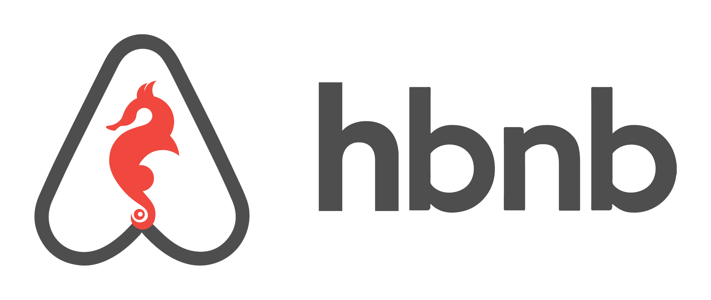

# 0x00. AirBnB clone - The console

# Description

First step: Write a command interpreter to manage your AirBnB objects.
This is the first step towards building your first full web application: the AirBnB clone. This first step is very important because you will use what you build during this project with all other following projects: HTML/CSS templating, database storage, API, front-end integration.

# The console
create your data model
manage (create, update, destroy, etc) objects via a console / command interpreter
store and persist objects to a file (JSON file)
The first piece is to manipulate a powerful storage system. This storage engine will give us an abstraction between “My object” and “How they are stored and persisted”. This means: from your console code (the command interpreter itself) and from the front-end and RestAPI you will build later, you won’t have to pay attention (take care) of how your objects are stored.

This abstraction will also allow you to change the type of storage easily without updating all of your codebase.

The console will be a tool to validate this storage engine

# How used the console:

To used this console:
* `(hbnb)` start: it start after excecuting the ./console.py:

* `(hbnb) help`: this command is to give help: if it follows for the name of a command, gives information about that command:

* `(hbnb) create BaseModel`: this command is to create a new BaseModel, and return an "id":

* `(hbnb) all BaseModel`: this command display all the existent models:

* `(hbnb) show BaseModel 831252b2-f7d6-4534-bf8b-9461da86a875 `: this command follow by the id of the BaseModel, display only the content of that BaseModel:

* `(hbnb) destroy BaseModel  cf1c49b8-f9b9-40fd-be86-03861c825c4a`: this command follow by the id of the BaseModel, delete the BaseModel:
* `(hbnb) update BaseModel  271a3ba3-dbec-461b-b8a3-e393cc607d45 first_name: "Jenny"`: this command goes with the BaseModel, id, and the field to add

* `(hbnb) quit`: this command is to exit the console:

### Tasks

Madatory:

| Name | Description |
| ------ | ------ |
| 0. README, AUTHORS | Write a README.md, You should have an AUTHORS file at the root of your repository, listing all individuals having contributed content to the repository |
| 1. Be PEP8 compliant! | Write beautiful code that passes the PEP8 checks. |
| 2. Unittests | All your files, classes, functions must be tested with unit tests, `python3 -m unittest discover tests` |
| 3. BaseModel | Write a class BaseModel that defines all common attributes/methods for other classes:models/base_model.py. Public instance attributes: id, created_at, updated_at, __str__. Public instance methods: save(self), to_dict(self). |
| 4. Create BaseModel from dictionary | Now it’s time to re-create an instance with this dictionary representation. |
| 5. Store first object | Now we can recreate a BaseModel from another one by using a dictionary representation |
| 6. Console 0.0.1 | Write a program called console.py that contains the entry point of the command interpreter |
| 7. Console 0.1 | Update your command interpreter (console.py) to have these commands |
| 8. First User | Write a class User that inherits from BaseModel |
| 9. More classes! | Write all those classes that inherit from BaseModel |
| 10. Console 1.0 | Update FileStorage to manage correctly serialization and deserialization of all our new classes: Place, State, City, Amenity and Review. Update your command interpreter (console.py) to allow those actions: show, create, destroy, update and all with all classes created previously. No unittests needed for the console |
